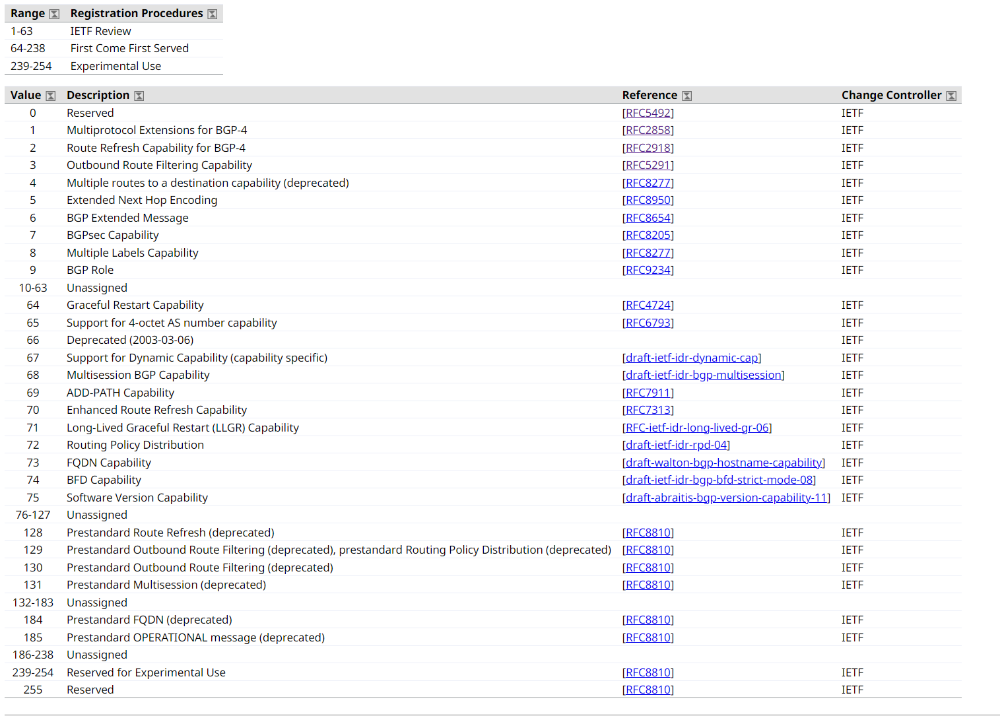
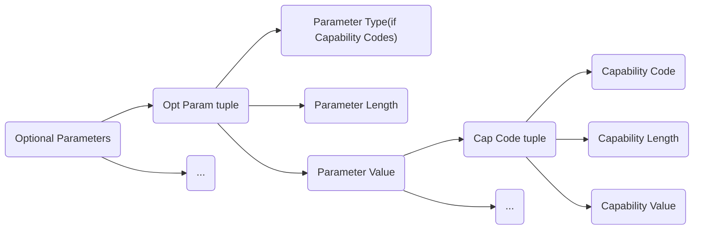
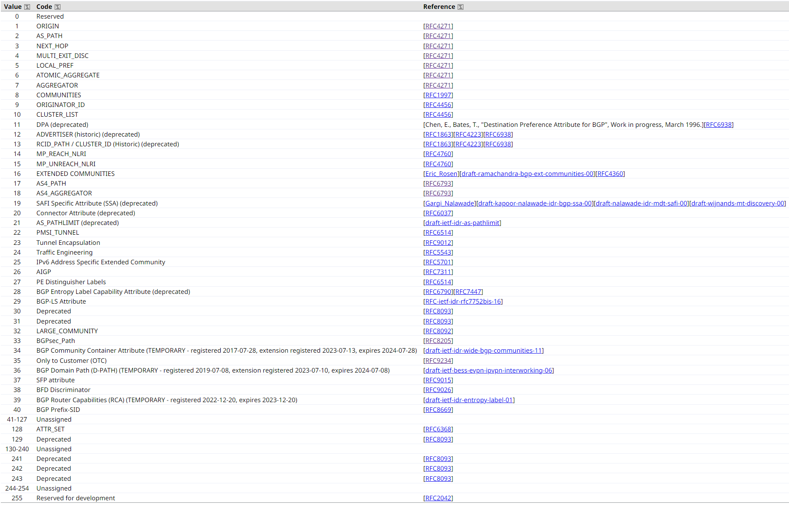
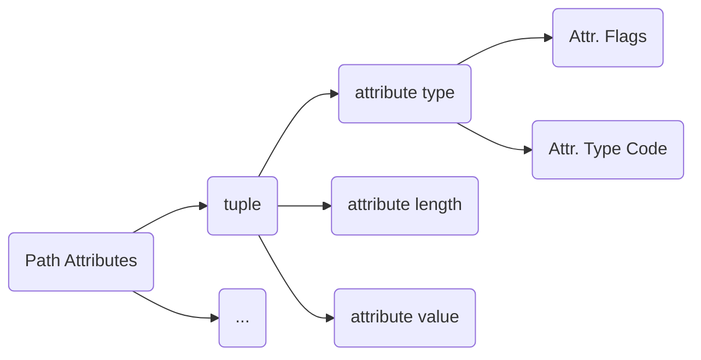
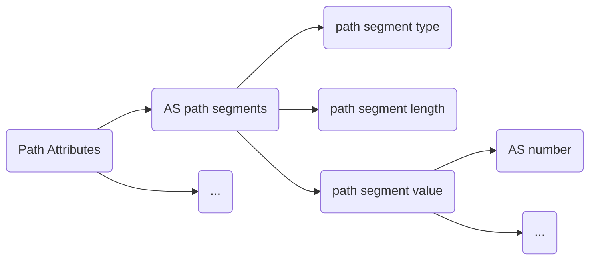

[toc]

## BGP协议主体格式

`BGP`协议主要由`Header`和`BGP Message Types`组成

### Message Header Format

`Header`结构为`Marker`（16字节）、`Length`（2字节）、`Type`（1字节）组成 
[=> RFC4271 Sec 4.1](https://www.rfc-editor.org/rfc/rfc4271#page-11)

```
0                   1                   2                   3
0 1 2 3 4 5 6 7 8 9 0 1 2 3 4 5 6 7 8 9 0 1 2 3 4 5 6 7 8 9 0 1
+-+-+-+-+-+-+-+-+-+-+-+-+-+-+-+-+-+-+-+-+-+-+-+-+-+-+-+-+-+-+-+-+
|                                                               |
+                                                               +
|                                                               |
+                                                               +
|                           Marker                              |
+                                                               +
|                                                               |
+-+-+-+-+-+-+-+-+-+-+-+-+-+-+-+-+-+-+-+-+-+-+-+-+-+-+-+-+-+-+-+-+
|          Length               |      Type     |
+-+-+-+-+-+-+-+-+-+-+-+-+-+-+-+-+-+-+-+-+-+-+-+-+
```

`Type`存在以下状态：

```
1 - OPEN
2 - UPDATE
3 - NOTIFICATION
4 - KEEPALIVE
5 - ROUTE-REFRESH
6 - DYNAMIC CAPABILITY
```

P.S `Type: 5 - ROUTE-REFRESH`出自 [RFC2918 Sec 3.](https://www.rfc-editor.org/rfc/rfc2918.html)
`Type: 6 - DYNAMIC CAPABILITY`出自 [draft-ietf-idr-dynamic-cap-16 Sec 3.](https://datatracker.ietf.org/doc/html/draft-ietf-idr-dynamic-cap-16#section-3)

### OPEN Message Format

`Open`结构为`Version`（1字节）、`My Autonomous System`（2字节）、`Hold Time`（2字节）、`BGP Identifier`（4字节，`BGP IP`）、`Optional Parameters Length`（1字节）、`Optional Parameters`（变长）
[=> RFC4271 Sec 4.2](https://www.rfc-editor.org/rfc/rfc4271#page-12)

```
0                   1                   2                   3
0 1 2 3 4 5 6 7 8 9 0 1 2 3 4 5 6 7 8 9 0 1 2 3 4 5 6 7 8 9 0 1
+-+-+-+-+-+-+-+-+
|    Version    |
+-+-+-+-+-+-+-+-+-+-+-+-+-+-+-+-+
|     My Autonomous System      |
+-+-+-+-+-+-+-+-+-+-+-+-+-+-+-+-+
|           Hold Time           |
+-+-+-+-+-+-+-+-+-+-+-+-+-+-+-+-+-+-+-+-+-+-+-+-+-+-+-+-+-+-+-+-+
|                         BGP Identifier                        |
+-+-+-+-+-+-+-+-+-+-+-+-+-+-+-+-+-+-+-+-+-+-+-+-+-+-+-+-+-+-+-+-+
| Opt Parm Len  |
+-+-+-+-+-+-+-+-+-+-+-+-+-+-+-+-+-+-+-+-+-+-+-+-+-+-+-+-+-+-+-+-+
|                                                               |
|             Optional Parameters (variable)                    |
|                                                               |
+-+-+-+-+-+-+-+-+-+-+-+-+-+-+-+-+-+-+-+-+-+-+-+-+-+-+-+-+-+-+-+-+
```

```
0                   1
0 1 2 3 4 5 6 7 8 9 0 1 2 3 4 5
+-+-+-+-+-+-+-+-+-+-+-+-+-+-+-+-+-+-+-+-...
|  Parm. Type   | Parm. Length  |  Parameter Value (variable)
+-+-+-+-+-+-+-+-+-+-+-+-+-+-+-+-+-+-+-+-...
```

`Optional Parameters`内部结构为1个或多个`<Parameter Type, Parameter Length, Parameter Value>`三元组（1字节，1字节，x字节）

```
This field contains a list of optional parameters, in which each parameter is encoded as a <Parameter Type, Parameter Length, Parameter Value> triplet.
```

`Parameter Type`可以为`Reserved`（`Parameter Type 0`）、`Authentication (deprecated)`（`Parameter Type 1`）、`Capability Codes`（`Parameter Type 2`）

最常用的还是`Capability Codes`，其内部格式为1个或多个`<Capability Code, Capability Length, Capability Value>`三元组 
[=> RFC3392 Sec 4.](https://www.rfc-editor.org/rfc/rfc3392)

```
+------------------------------+
| Capability Code (1 octet)    |
+------------------------------+
| Capability Length (1 octet)  |
+------------------------------+
| Capability Value (variable)  |
+------------------------------+
```

其中`Capability-Code`可为如下的值


[=> IANA-Capability-Codes](https://www.iana.org/assignments/capability-codes/capability-codes.xhtml)

整个结构如下


#### (1) Multiprotocol Extensions for BGP-4 

`Capability Code`字段为1
`Capability Length`字段为变长
`Capability Value`如下：`Address Family Identifier`（2字节）、`Reserved`（1字节，默认为0）、`Subsequent Address Family Identifier`（1字节）

```
0       7      15      23      31
+-------+-------+-------+-------+
|      AFI      | Res.  | SAFI  |
+-------+-------+-------+-------+
```
[=> RFC2858 Sec 7.](https://www.rfc-editor.org/rfc/rfc2858.html#section-7)

#### (2) Route Refresh Capability for BGP-4 

`Capability Code`字段为2
`Capability Length`字段为0
[=> RFC2918 Sec 2.](https://www.rfc-editor.org/rfc/rfc2918.html#section-2)

#### (3) Outbound Route Filtering Capability 

`Capability Code`字段为3
`Capability Length`字段为变长
`Capability Value`字段为一个或者多个如下结构

```
+--------------------------------------------------+
| Address Family Identifier (2 octets)             |
+--------------------------------------------------+
| Reserved (1 octet)                               |
+--------------------------------------------------+
| Subsequent Address Family Identifier (1 octet)   |
+--------------------------------------------------+
| Number of ORFs (1 octet)                         |
+--------------------------------------------------+
| ORF Type (1 octet)                               |
+--------------------------------------------------+
| Send/Receive (1 octet)                           |
+--------------------------------------------------+
| ...                                              |
+--------------------------------------------------+
| ORF Type (1 octet)                               |
+--------------------------------------------------+
| Send/Receive (1 octet)                           |
+--------------------------------------------------+
```

其中`Send/Receive`值只能为1、2、3
[=> RFC5291 Sec 5.](https://www.rfc-editor.org/rfc/rfc5291.html#section-5)

#### (4) Multiple routes to a destination capability (deprecated) 

`Capability Code`字段为4
但是被弃用
[=> RFC8277 Sec 6.](https://www.rfc-editor.org/rfc/rfc8277.html#section-6)

#### (5) Extended Next Hop Encoding 

`Capability Code`字段为5
`Capability Length`字段为变长

```
+-----------------------------------------------------+
| NLRI AFI - 1 (2 octets)                             |
+-----------------------------------------------------+
| NLRI SAFI - 1 (2 octets)                            |
+-----------------------------------------------------+
| Nexthop AFI - 1 (2 octets)                          |
+-----------------------------------------------------+
| .....                                               |
+-----------------------------------------------------+
| NLRI AFI - N (2 octets)                             |
+-----------------------------------------------------+
| NLRI SAFI - N (2 octets)                            |
+-----------------------------------------------------+
| Nexthop AFI - N (2 octets)                          |
+-----------------------------------------------------+
```
[=> RFC8950 Sec 4.](https://www.rfc-editor.org/rfc/rfc8950.html#section-4)

#### (6) BGP Extended Message 

`Capability Code`字段为6
`Capability Length`字段为0
[=> RFC8654 Sec 3.](https://www.rfc-editor.org/rfc/rfc8654.html#section-3)

#### (7) BGPsec Capability 

`Capability Code`字段为7
`Capability Length`字段为3
`Capability Value`字段如下

```
  0   1   2   3      4      5   6   7
+---------------------------------------+
| Version          | Dir |  Unassigned  |
+---------------------------------------+
|                                       |
+------           AFI              -----+
|                                       |
+---------------------------------------+
```
[=> RFC8205 Sec 2.1.](https://www.rfc-editor.org/rfc/rfc8205.html#section-2.1)

#### (8) Multiple Labels Capability

`Capability Code`字段为8
`Capability Length`字段为变长
`Capability Value`字段为一个或多个`<AFI, SAFI, Count>`三元组

```
 0                   1                   2                   3
 0 1 2 3 4 5 6 7 8 9 0 1 2 3 4 5 6 7 8 9 0 1 2 3 4 5 6 7 8 9 0 1
+-+-+-+-+-+-+-+-+-+-+-+-+-+-+-+-+-+-+-+-+-+-+-+-+-+-+-+-+-+-+-+-+
|              AFI              |    SAFI       |    Count      ~
+-+-+-+-+-+-+-+-+-+-+-+-+-+-+-+-+-+-+-+-+-+-+-+-+-+-+-+-+-+-+-+-+
~              AFI              |    SAFI       |    Count      |
+-+-+-+-+-+-+-+-+-+-+-+-+-+-+-+-+-+-+-+-+-+-+-+-+-+-+-+-+-+-+-+-+
```
[=> RFC8277 Sec 2.1.](https://www.rfc-editor.org/rfc/rfc8277.html#section-2.1)

#### (9) BGP Role

`Capability Code`字段为9
`Capability Length`字段为1
`Capability Value`字段如下

```
Value	Role name (for the local AS)
0	Provider
1	RS
2	RS-Client
3	Customer
4	Peer (i.e., Lateral Peer)
5-255	Unassigned
```
[=> RFC9234 Sec 4.1.](https://www.rfc-editor.org/rfc/rfc9234.html#name-bgp-role-capability)

#### (64) Graceful Restart Capability

`Capability Code`字段为64
`Capability Length`字段为变长
`Capability Value`字段为`ReStart Flags`、`Restart Time in seconds`和一个或多个`<AFI, SAFI, Flags for Address Family>`三元组

```
+--------------------------------------------------+
| Restart Flags (4 bits)                           |
+--------------------------------------------------+
| Restart Time in seconds (12 bits)                |
+--------------------------------------------------+
| Address Family Identifier (16 bits)              |
+--------------------------------------------------+
| Subsequent Address Family Identifier (8 bits)    |
+--------------------------------------------------+
| Flags for Address Family (8 bits)                |
+--------------------------------------------------+
| ...                                              |
+--------------------------------------------------+
| Address Family Identifier (16 bits)              |
+--------------------------------------------------+
| Subsequent Address Family Identifier (8 bits)    |
+--------------------------------------------------+
| Flags for Address Family (8 bits)                |
+--------------------------------------------------+


Restart Flags:
 0 1 2 3
+-+-+-+-+
|R|Resv.|
+-+-+-+-+

Flags for Address Family:
 0 1 2 3 4 5 6 7
+-+-+-+-+-+-+-+-+
|F|   Reserved  |
+-+-+-+-+-+-+-+-+
```
[=> RFC4724 Sec 3.](https://www.rfc-editor.org/rfc/rfc4724.html#section-3)

#### (65) Support for 4-octet AS number capability

`Capability Code`字段为65
`Capability Length`字段为4
`Capability Value`字段为4字节的`AS number`
[=> RFC6793 Sec 3.](https://www.rfc-editor.org/rfc/rfc6793.html#section-3)

#### (67) Support for Dynamic Capability (capability specific)

`Capability Code`字段为67
`Capability Length`字段为变长
`Capability Value`字段是一串`capability codes`，每个一字节

```
The Capability Value field consists of a list of capability codes (one-octet for each) that specify the capabilities that MAY be revised dynamically by the remote speaker.
```
[=> draft-ietf-idr-dynamic-cap-16 Sec 2.](https://datatracker.ietf.org/doc/html/draft-ietf-idr-dynamic-cap-16#section-2)

#### (68) Multisession BGP Capability

`Capability Code`字段为68
`Capability Length`字段为变长
`Capability Value`字段是一个`Flags`（`G`+`Reserved`）和0个或多个`capability codes`用于区别不同的组

```
 0 1 2 3 4 5 6 7 8 9 0 1 2 3 4 5
+-+-+-+-+-+-+-+-+-+-+-+-+-+-+-+-+
|G|  Reserved   |  Session Id   ~
+-+-+-+-+-+-+-+-+-+-+-+-+-+-+-+-+
```
[=> draft-ietf-idr-bgp-multisession-07 Sec 4.](https://datatracker.ietf.org/doc/html/draft-ietf-idr-bgp-multisession-07#section-4) 

#### (69) ADD-PATH Capability

`Capability Code`字段为69
`Capability Length`字段为变长
`Capability Value`字段为一个或多个`<AFI, SAFI, Send/Receive>`三元组

```
+------------------------------------------------+
| Address Family Identifier (2 octets)           |
+------------------------------------------------+
| Subsequent Address Family Identifier (1 octet) |
+------------------------------------------------+
| Send/Receive (1 octet)                         |
+------------------------------------------------+
```
[=> RFC7911 Sec 4.](https://www.rfc-editor.org/rfc/rfc7911.html#section-4)

#### (70) Enhanced Route Refresh Capability

`Capability Code`字段为70
`Capability Length`字段为0
[=> RFC7313 Sec 3.1.](https://www.rfc-editor.org/rfc/rfc7313.html#section-3.1)

#### (71) Long-Lived Graceful Restart (LLGR) Capability

`Capability Code`字段为71
`Capability Length`字段为变长
`Capability Value`字段为0个或多个`<AFI, SAFI, Flags, Long-lived Stale Time>`四元组

```
+--------------------------------------------------+
| Address Family Identifier (16 bits)              |
+--------------------------------------------------+
| Subsequent Address Family Identifier (8 bits)    |
+--------------------------------------------------+
| Flags for Address Family (8 bits)                |
+--------------------------------------------------+
| Long-lived Stale Time (24 bits)                  |
+--------------------------------------------------+
| ...                                              |
+--------------------------------------------------+
| Address Family Identifier (16 bits)              |
+--------------------------------------------------+
| Subsequent Address Family Identifier (8 bits)    |
+--------------------------------------------------+
| Flags for Address Family (8 bits)                |
+--------------------------------------------------+
| Long-lived Stale Time (24 bits)                  |
+--------------------------------------------------+
```
[=> RFC-ietf-idr-long-lived-gr-06 Sec 3.1](https://www.ietf.org/archive/id/draft-ietf-idr-long-lived-gr-06.html#section-3.1)

#### (72) Routing Policy Distribution

`Capability Code`字段为72
`Capability Length`字段为变长
`Capability Value`字段为1个或多个`<AFI, SAFI, Send/Receive>`三元组

```
+--------------------------------------------------+
|  Address Family Identifier (2 octets)            |
+--------------------------------------------------+
|  Subsequent Address Family Identifier (1 octet)  |
+--------------------------------------------------+
|  Send/Receive (1 octet)                          |
+--------------------------------------------------+
```
[=> draft-ietf-idr-rpd-04 Sec 4.3](https://datatracker.ietf.org/doc/html/draft-ietf-idr-rpd-04#section-4.3)

#### (128) Prestandard Route Refresh (deprecated)

同 (2) Route Refresh Capability for BGP-4

#### (130) Prestandard Outbound Route Filtering (deprecated)

同 (3) Outbound Route Filtering Capability 


### UPDATE Message Format

`UPDATE Message`主要用来构建描述各种自治域的关系图，用于向`peer`通告共享公共路径属性的可行路由或者撤回多个不可行路由

`update`结构为`Withdrawn Routes Length`（2字节）、`Withdrawn Routes`（变长）、`Total Path Attribute Length`（2字节）、`Path Attributes`（变长，其长度值为前一个字段）、`Network Layer Reachability Information`（变长，其长度值为`Header`长度减去`Total Path Attribute Length`）

```
+-----------------------------------------------------+
|   Withdrawn Routes Length (2 octets)                |
+-----------------------------------------------------+
|   Withdrawn Routes (variable)                       |
+-----------------------------------------------------+
|   Total Path Attribute Length (2 octets)            |
+-----------------------------------------------------+
|   Path Attributes (variable)                        |
+-----------------------------------------------------+
|   Network Layer Reachability Information (variable) |
+-----------------------------------------------------+
```

`Withdrawn Routes`中是一些`IP address prefix`，每个`IP address prefix`都是`<length, prefix>`的二元组

```
+---------------------------+
|   Length (1 octet)        |
+---------------------------+
|   Prefix (variable)       |
+---------------------------+
```

每个`Path Attributes`都是一组`<attribute type, attribute length, attribute value>`三元组

`Attribute Type`是二个字节的字段。`Attr. Flags`、`Attr. Type Code`均一个字节

```
0                   1
0 1 2 3 4 5 6 7 8 9 0 1 2 3 4 5
+-+-+-+-+-+-+-+-+-+-+-+-+-+-+-+-+
|  Attr. Flags  |Attr. Type Code|
+-+-+-+-+-+-+-+-+-+-+-+-+-+-+-+-+
```
[=> RFC4271 Sec 4.3](https://www.rfc-editor.org/rfc/rfc4271.html#section-4.3)

`Attr. Flags`每个`bits`的`0/1`均有不同的含义，例如第四个`bit`（`bit 3`）表示是否是一个`Extended`长度的比特位，如果为0，则`Attribute Length`是1个字节，如果为1，则是2个字节

`Attr. Type Code`值如下



整个结构如下


#### (1) ORIGIN

`Type Code`为1
`Attribute Len`为1
`Attribute Value`可以为`IGP(0)`，`EGP(1)`，`INCOMPLETE(2)`

[=> RFC4271 Sec 4.3](https://www.rfc-editor.org/rfc/rfc4271.html#section-4.3)

#### (2) AS_PATH

`Type Code`为2
`Attribute Len`为变长
`Attribute Value`为一组`AS path segments`，每一个`AS path segments`表示为`<path segment type（1字节）, path segment length（1字节）, path segment value（变长）>`三元组，

`path segment type`可以为`AS_SET(1)`，`AS_SEQUENCE(2)`
`path segment length`为`ASes`的个数（不是`path segment value`的字节长度）
`path segment value`为一个或多个`AS`编号，每个编号2个字节

[=> RFC4271 Sec 4.3](https://www.rfc-editor.org/rfc/rfc4271.html#section-4.3)

整个结构如下


#### (3) NEXT_HOP

`Type Code`为3
`Attribute Len`为4
`Attribute Value`为`IP address`

[=> RFC4271 Sec 4.3](https://www.rfc-editor.org/rfc/rfc4271.html#section-4.3)

#### (4) MULTI_EXIT_DISC

`Type Code`为4
`Attribute Len`为4
`Attribute Value`为4个字节的无符号整数，用于区别邻居自治域的入口点

[=> RFC4271 Sec 4.3](https://www.rfc-editor.org/rfc/rfc4271.html#section-4.3)

#### (5) LOCAL_PREF

`Type Code`为5
`Attribute Len`为4
`Attribute Value`为4个字节的无符号整数，用于通知内部对等节点，广告路由的偏好程度（不是很理解）

[=> RFC4271 Sec 4.3](https://www.rfc-editor.org/rfc/rfc4271.html#section-4.3)

#### (6) ATOMIC_AGGREGATE

`Type Code`为6
`Attribute Len`为0

[=> RFC4271 Sec 4.3](https://www.rfc-editor.org/rfc/rfc4271.html#section-4.3)

#### (7) AGGREGATOR

`Type Code`为7
`Attribute Len`为6（某些实现下为8，即`AS number(4字节)`）
`Attribute Value`为`the last AS number(2字节)`，`the IP address(4字节)`

#### (8) COMMUNITIES

`Type Code`为8
`Attribute Len`为变长
`Attribute Value`为一组4字节的`community`

[=> RFC1997](https://www.rfc-editor.org/rfc/rfc1997.html)

#### (9) ORIGINATOR_ID

`Type Code`为9
`Attribute Len`为4
`Attribute Value`为本地自治域的`BGP Identifier`

`ORIGINATOR_ID`和`CLUSTER_LIST`一起是防止路由环路的

[=> RFC4456 Sec 8.](https://www.rfc-editor.org/rfc/rfc4456.html#section-8)

#### (10) CLUSTER_LIST

`Type Code`为10
`Attribute Len`为变长
`Attribute Value`为一组4字节的`CLUSTER_ID`

[=> RFC4456 Sec 8.](https://www.rfc-editor.org/rfc/rfc4456.html#section-8)

#### (14) MP_REACH_NLRI 

`Type Code`为14
`Attribute Len`为变长
`Attribute Value`为`AFI(2字节)`、`SAFI(1字节)`、`Length of Next Hop Network Address(1字节)`、`Network Address of Next Hop(变长)`、`Reserved(1字节)`、`NLRI(变长)`

`Network Address of Next Hop`和`NLRI`均由`<AFI, SAFI>`标识

```
+---------------------------------------------------------+
| Address Family Identifier (2 octets)                    |
+---------------------------------------------------------+
| Subsequent Address Family Identifier (1 octet)          |
+---------------------------------------------------------+
| Length of Next Hop Network Address (1 octet)            |
+---------------------------------------------------------+
| Network Address of Next Hop (variable)                  |
+---------------------------------------------------------+
| Reserved (1 octet)                                      |
+---------------------------------------------------------+
| Network Layer Reachability Information (variable)       |
+---------------------------------------------------------+
```

[=> RFC4760 Sec 3.](https://www.rfc-editor.org/rfc/rfc4760.html#section-3)

#### (15) MP_UNREACH_NLRI 

`Type Code`为15
`Attribute Len`为变长
`Attribute Value`为`AFI(2字节)`、`SAFI(1字节)`、`Withdrawn Routes(变长)`

```
+---------------------------------------------------------+
| Address Family Identifier (2 octets)                    |
+---------------------------------------------------------+
| Subsequent Address Family Identifier (1 octet)          |
+---------------------------------------------------------+
| Withdrawn Routes (variable)                             |
+---------------------------------------------------------+
```

`Withdrawn Routes`由`<AFI, SAFI>`标识

[=> RFC4760 Sec 4.](https://www.rfc-editor.org/rfc/rfc4760.html#section-4)

#### (16) EXTENDED COMMUNITIES

`Type Code`为16
`Attribute Len`为变长
`Attribute Value`为一系列`extended communities`，每个`Extended Community`均是8个字节的如下结构

如果是`Regular type`，则是1个字节，如果是`Extended type`，则是2个字节

```
- Type Field  : 1 or 2 octets
- Value Field : Remaining octets

 0                   1                   2                   3
 0 1 2 3 4 5 6 7 8 9 0 1 2 3 4 5 6 7 8 9 0 1 2 3 4 5 6 7 8 9 0 1
+-+-+-+-+-+-+-+-+-+-+-+-+-+-+-+-+-+-+-+-+-+-+-+-+-+-+-+-+-+-+-+-+
|  Type high    |  Type low(*)  |                               |
+-+-+-+-+-+-+-+-+-+-+-+-+-+-+-+-+          Value                |
|                                                               |
+-+-+-+-+-+-+-+-+-+-+-+-+-+-+-+-+-+-+-+-+-+-+-+-+-+-+-+-+-+-+-+-+
```

[=> RFC4360 Sec 2.](https://www.rfc-editor.org/rfc/rfc4360.html#section-2)

#### (17) AS4_PATH

`Type Code`为17
`Attribute Len`为4
`Attribute Value`为4字节的`AS4_PATH`

[=> RFC6793 Sec 9.](https://www.rfc-editor.org/rfc/rfc6793.html#section-9)

#### (18) AS4_AGGREGATOR

`Type Code`为18
`Attribute Len`为8
`Attribute Value`为`the last AS number(4字节)`，`the IP address(4字节)`

[=> RFC6793 Sec 9.](https://www.rfc-editor.org/rfc/rfc6793.html#section-9)

